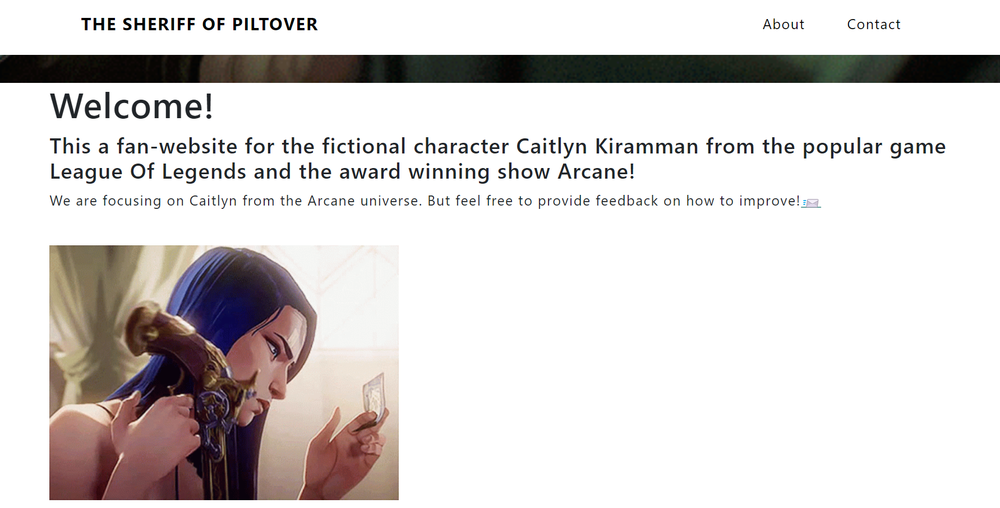
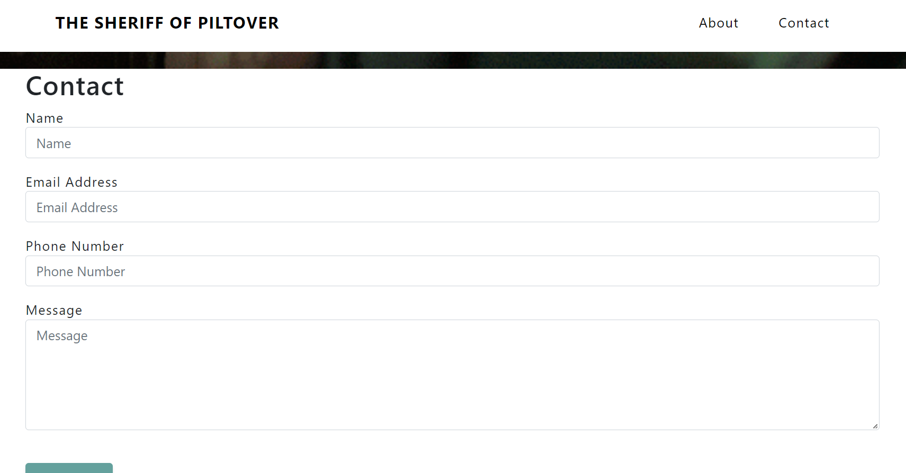
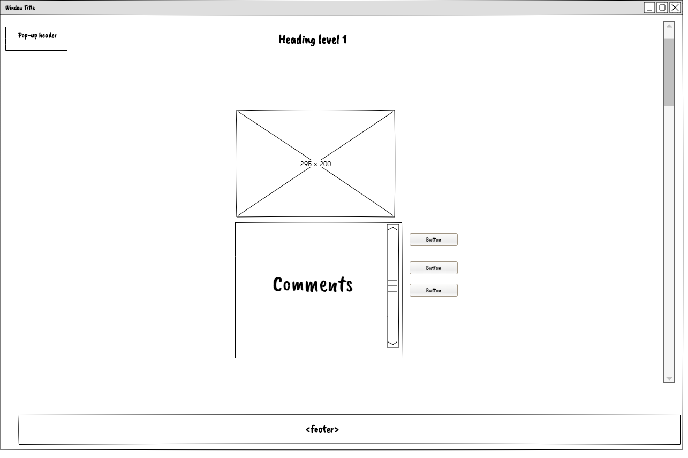

# Caitlyn Kirraman Fan-Website

## Description

This a fan-website for the fictional character Caitlyn Kiramman from the popular game League Of Legends and the award winning show Arcane!

This website will mainly focus on the Arcane universe, but users will still able to read about Caitlyn from the original League Of Legends universe and Alternate Universes.

## UX

### Features

- Home page
  - The home page features a header with an animated background
  
  - Along with a welcome message
    
- Contact page
  - in this page user will be able to provide feedback and ideas on how imporve the website
      

## Future Features Implementations

- Comment section
  - Where users could comment on about Caitlyn's bio page and have discussions about different missions
- Community Page
  - A page where users would able to share gameplay clips and fan-art
  - With the ability for users to Login and even take notes from the Tip page for their own gameplay 
 

## Bugs & Fixes

- Cannot deploy to Heroku due to "App not compatible with buildpack" error.
  - Have not found a way to resolve this error
- IP missmatch error from Heroku CLI.
  - According to their website, the platform requires that the IP address of both the CLI and web browser align. This means that you will need to have the same proxy setup for both the CLI and the browser used to authenticate. You'll need to configure the web proxy in the CLI with the 'https_proxy option'.
    - So far that has not worked and the deployment has been difficult.

## Technologies Used

- Python
  - Flask
    - It is a lightweight Python web framework that provides useful tools and features for creating web applications in the Python Language.
- HTML
- CSS
- Obsidian
  - Obsidian is a note-taking app that stores files locally on your device instead of in the cloud. With Obsidian, you use markdown language to create your notes.

## Deployment

Heroku:

- This project still has major deployment issues. So far every attempt made to deploy through heroku has failed.
